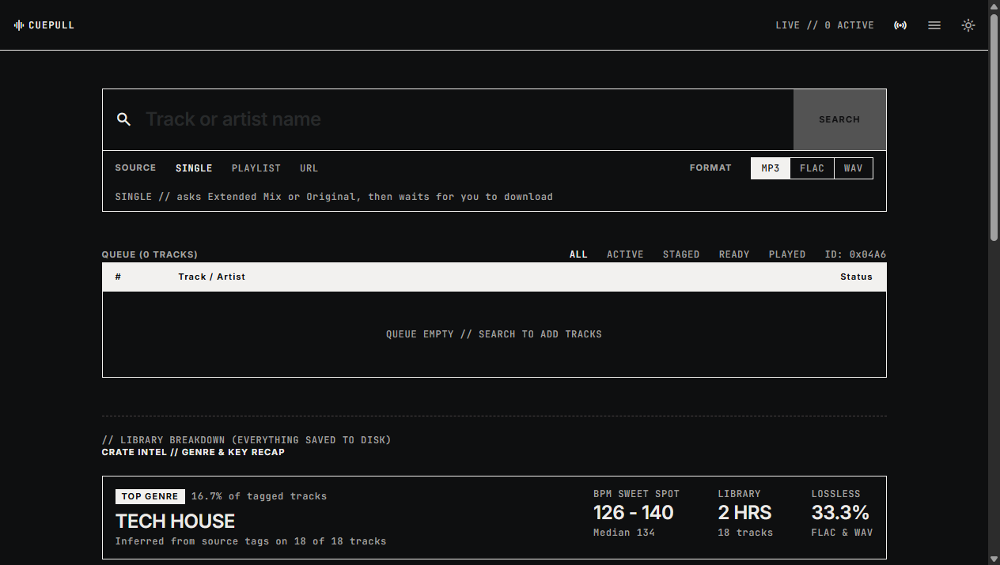
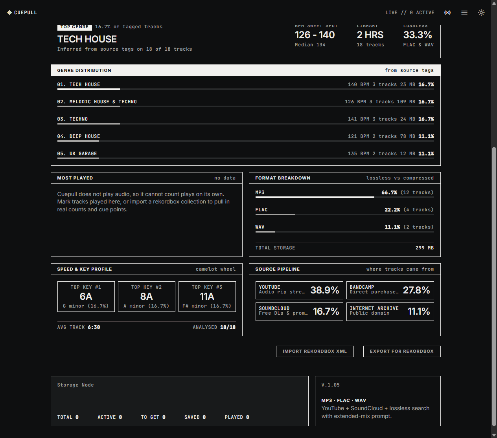
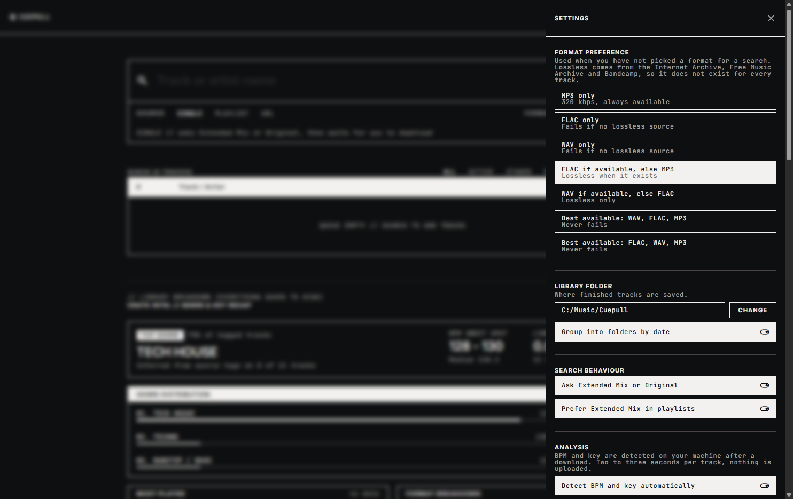
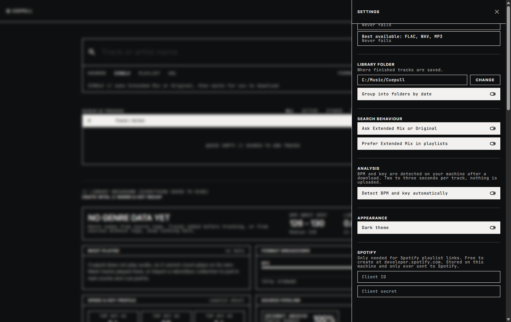

# Cuepull

A desktop app for building a DJ library. Type a track name or paste a link,
pick a format, and it finds a source and pulls down the audio. Nothing is
written to disk until you press download.

Once tracks are saved it orders them into a setlist by key and tempo, and there
are two decks in the app so you can hear a transition without opening
rekordbox.

Windows desktop app. A macOS build exists but has not been tested on real
hardware yet, so it is not in the releases: see [Trying it on
macOS](#trying-it-on-macos) if you have a Mac and are willing to help. There is
also a browser version if you prefer running it that way.





## What it does

**Search by name.** Type `Artist - Song` and it searches YouTube and
SoundCloud. If an Extended Mix turns up, it stops and asks which version you
want before going any further.

**Paste a link.** Spotify playlists, albums and tracks work (public ones), plus
SoundCloud and Bandcamp URLs. A Spotify playlist gets read for its track names,
then every track is searched individually.

**Pick a format.** MP3 at 320 kbps, or FLAC and WAV from genuinely lossless
sources.

**Queue that shows what is happening.** Every track reports its state as it
moves: searching, found, downloading, saved. Progress updates live.

**Downloads happen when you ask.** Searching only finds a source. The track
sits in the queue marked `READY TO GET` until you hit the download button on
that row, or Download All. Then you choose where the file goes.

**BPM and key, worked out locally.** Every saved track is analysed on your
machine. Nothing is uploaded.

**A setlist you could play.** Orders the library by key, tempo and energy, and
says why each pair of tracks sits together.

**Two decks.** Load a track on each side and hear the transition, with beat
grids, EQ, sync and a recorder. See [Decks](#decks).

## Install

**Windows.** Download `Cuepull Setup <version>.exe` from
[Releases](../../releases) and run it. It installs for your user only, so there
is no admin prompt, and it ships its own copies of yt-dlp and ffmpeg. Nothing
else to install.

**macOS.** Not released yet, because it has never been run on a Mac. See
[Trying it on macOS](#trying-it-on-macos).

### About the SmartScreen warning

The installer is not code signed, so Windows shows a blue "Windows protected
your PC" screen the first time. Click **More info**, then **Run anyway**.

That warning means Windows has not seen this file enough times to trust it,
not that anything is wrong with it. Code signing certificates cost a few
hundred dollars a year, which is hard to justify for a free tool.

If you would rather verify the download than take my word for it, every
release ships a `SHA256SUMS.txt`. Check your copy matches:

```powershell
Get-FileHash "Cuepull Setup 1.0.0.exe" -Algorithm SHA256
```

Compare the result against the line in `SHA256SUMS.txt`. If they match, the
file is byte for byte the one that was built. If they do not, delete it and
download again.

You can also build the installer yourself with the steps below, which avoids
the warning question entirely.

## Trying it on macOS

The macOS build is not in the releases yet. It compiles on CI, both an Apple
Silicon and an Intel `.dmg`, but nobody has launched it on a real Mac. I build
on Windows and do not own one. So everything below is untested, and the point
of it is to find out what breaks.

If you try it, what I need to know is in [What to check](#what-to-check) at the
end of this section.

### Getting a build

Two options.

**Download one from CI.** Open the
[Actions tab](../../actions/workflows/release.yml), click the newest run with a
green tick, scroll to **Artifacts** at the bottom, and download
`cuepull-macos`. It is a zip holding both dmgs. Artifacts expire 90 days after
the run, and GitHub requires you to be signed in to download them.

Pick the dmg that matches your Mac. Apple menu, About This Mac: an **Apple M1,
M2, M3** or later chip needs `arm64`, an **Intel** processor needs `x64`. The
wrong one will not run.

**Or build it yourself.** Needs Node 22 or newer:

```bash
git clone https://github.com/brendenmonteiro/cuepull.git
cd cuepull
npm install
npm run dist
```

The dmg lands in `dist/`. The first run also downloads yt-dlp and ffmpeg into
`resources/bin/`, around 120 MB.

### Opening it past Gatekeeper

The app is not code signed or notarized, so macOS will refuse it on the first
try. On recent versions the message is **"Cuepull is damaged and can't be
opened. You should move it to the Bin."**

Nothing is damaged. That is what Gatekeeper says about any app it cannot
verify, and the wording is worse than the Windows equivalent. It is also the
main reason I have not published this build: the message reads like a corrupt
download, and most people would delete it rather than work around it.

Open the dmg and drag Cuepull to Applications, then:

```bash
xattr -dr com.apple.quarantine /Applications/Cuepull.app
```

That removes the quarantine flag macOS puts on anything downloaded from the
internet. Then open the app normally.

Right-click, Open sometimes works instead and avoids the terminal, but on
current macOS the "damaged" case usually needs the `xattr` command.

Only run that on software you actually mean to trust. If you would rather
check the download first, the CI artifact includes `SHA256SUMS.txt`:

```bash
shasum -a 256 Cuepull-1.1.0-arm64.dmg
```

Compare it to the matching line in that file. Building it yourself sidesteps
the question.

### What to check

Rough order of how likely each is to break:

1. **It opens at all.** A window, not a crash, not a blank grey rectangle.
2. **Search works.** Type `Scott Joplin - Maple Leaf Rag` and press enter. It
   should reach `READY TO GET`. This is the one that proves the bundled yt-dlp
   and ffmpeg survived packaging and can execute, which is the part I most
   expect to fail.
3. **A download completes.** Press the download button on that row. It should
   save an mp3 and the track should turn `READY`.
4. **The file is real.** Somewhere under `~/Music`, in a folder named for
   today's date, and it should play.
5. **Quitting leaves nothing behind.** Quit, then run
   `pgrep -l "yt-dlp|ffmpeg|Cuepull"`. It should print nothing. Windows needed
   explicit cleanup for this and the macOS path has never been exercised.
6. **Settings open.** The hamburger menu, top right. Changing the library
   folder should stick after a restart.

[Open an issue](../../issues) with what happened, your macOS version, and
whether you are on Apple Silicon or Intel. A report that it worked is as useful
as one that it did not, since right now I know neither.

If the app will not start, this gives me something to work with:

```bash
/Applications/Cuepull.app/Contents/MacOS/Cuepull
```

That runs it from a terminal so errors print instead of disappearing.

## Build it yourself

```bash
git clone https://github.com/brendenmonteiro/cuepull.git
cd cuepull
npm install
npm run dist
```

That writes the installer to `dist/`. The first `npm run dist` also downloads
yt-dlp and ffmpeg into `resources/bin/`, about 117 MB. Those binaries are not
in the repo because they are large and carry their own licenses.

To run it without building an installer:

```bash
npm run build:ui
npm start
```

Add `npm run start:debug` instead of `npm start` if you want DevTools open.

## Using it

Pick a source mode at the top: `SINGLE` for a name, `PLAYLIST` for a Spotify or
SoundCloud playlist, `URL` for a direct link. Pick a format. Type or paste,
then hit enter.

For a single track, a prompt asks whether you want the Extended Mix or the
original. Pick one and the track drops into the queue.

Tracks sit at `READY TO GET` until you download them. Hover a row and click the
download arrow to fetch that one track and choose where to save it, or use
Download All to pick one folder and save everything at once.

Fetched files land in your library folder, sorted into a folder per day like
`27-09-2026`. Change where that is under File, Edit Configuration.

## Crate intel

Under the queue is a breakdown of everything saved to disk: format split,
storage, BPM sweet spot, top Camelot keys, genre and where tracks came from.



Reading the panel, left to right and top to bottom:

- **Top genre and headline figures.** Dominant genre, the BPM range most of
  the library sits in, total hours and how much of it is lossless.
- **Genre distribution.** Each genre with its average BPM, track count and
  size on disk.
- **Most played.** Empty until you either mark tracks played or import a
  rekordbox collection, because the app never plays audio itself.
- **Format breakdown.** MP3 against FLAC and WAV, with total storage.
- **Speed and key profile.** The three Camelot keys the library leans on, plus
  average track length and how many tracks have been analysed.
- **Source pipeline.** Where tracks came from: YouTube, Bandcamp, SoundCloud,
  the Internet Archive and so on.

BPM and key are detected locally with [Essentia](https://essentia.upf.edu/),
the same analysis library behind the audio features Spotify retired in 2024.
It runs on your machine, takes two or three seconds per track in the
background after a download, and nothing is uploaded. Key detection lands
right most of the time but not always, so treat a single reading as a strong
hint rather than gospel.

Genre is inferred from the tags the source supplied. YouTube has no genre
field, so this is a best guess and tracks without usable tags show nothing
rather than a made up label.

Cuepull never plays audio, so it cannot count plays by itself. Two buttons
bridge that:

- **Export for rekordbox** writes a collection XML with BPM and key already
  filled in, so tracks import pre analysed instead of needing a rekordbox
  analysis pass.
- **Import rekordbox XML** reads a collection you exported from rekordbox
  (File, Export Collection in xml format) and pulls back real play counts and
  cue points.

Ableton needs nothing: it watches folders, so pointing it at your library
works already.

## Setlist

**BUILD SETLIST** orders your library into something you could play front to
back: keys that sit next to each other on the Camelot wheel, tempos close
enough to ride the pitch fader, and energy that builds rather than wanders.
Around 140ms for 55 tracks.

**PICK TRACKS** opens the library with a filter over name, artist, key and
bpm. Tick what you want and only those get ordered. Nothing ticked orders
everything.

Between every pair of rows it says why they sit together: "one step on the
wheel, +1.1 bpm". A join you can argue with is more useful than a score you
cannot. Rough joins are marked.

Tracks with no tempo neighbour are listed separately rather than wedged in.
Nothing can make 87 bpm sit next to 121, and forcing it reads as a bug rather
than what it is. Half and double time count as neighbours, so a 75 belongs
fine in a 150 crate.

## Decks

Press play on a setlist row and the track loads into a free deck. Two decks,
a crossfader, and enough of a mixer to hear whether a transition works.

Each deck has a scrolling detail waveform with the beat grid drawn behind it,
a clickable overview strip, cue, play, three band EQ with a kill at the bottom
of each, a channel fader, and a pitch fader that shows the resulting bpm. The
zoom slider sets how many seconds are visible, from 4 to 40: wider means the
waveform crawls instead of racing, which makes it easier to hit a beat.

**SYNC** matches one deck to the other. It schedules the follower to start on
the leader's next grid line, from its own nearest grid line, so the downbeats
land together rather than the tempos merely matching. A lock then holds it,
correcting drift by under 0.4% every quarter second, which is inaudible. The
lock releases when either deck stops or when you click the badge.

A pitch fader only reaches 8%, so two tracks further apart than that cannot be
beatmatched this way. Sync says so rather than doing nothing.

**RECORD** captures what comes out of the crossfader, both decks with the EQ
and faders applied, and saves a webm when you stop.

Cue is momentary, like a CDJ: hold to preview from the cue point, release and
it snaps back. **SET** drops a cue point at the playhead.

| Key | Action |
|---|---|
| `Q` / `P` | play or pause deck A / B |
| `W` / `O` | hold to preview from the cue point |
| `E` / `I` | jump to the cue point and keep playing |
| `S` / `L` | set a cue point at the playhead |
| `1` `2` `3` `4` / `7` `8` `9` `0` | nudge pitch |
| `Z` / `C` / `X` | crossfader left, centre, right |

This is a preview player. Latency is fine for auditioning a transition, not
for playing a set on a controller, and there is no time stretching yet: the
pitch fader moves pitch along with tempo, the way a turntable does.

## Settings

Open the menu (the hamburger, top right) for everything configurable.



Format preference is the one worth understanding. The single format options
do exactly what they say and will fail when no source has that format. The
fallback options try each in turn, so "best available" always gets you
something:



Everything in the drawer:

| Setting | What it does |
|---|---|
| Format preference | What to fetch when you have not picked a format for a search. Single formats, fallbacks like "FLAC if available, else MP3", or "best available" which tries WAV, FLAC then MP3 and never fails. |
| Library folder | Where finished tracks are saved. Takes effect immediately. |
| Group into folders by date | Off puts everything in one flat folder instead of DD-MM-YYYY subfolders. |
| Ask Extended Mix or Original | Off decides automatically from the next setting instead of prompting each time. |
| Prefer Extended Mix in playlists | Which version wins where there is no prompt. |
| Detect BPM and key | Off skips the analysis pass after each download. |
| Theme | Light or dark. |
| Spotify credentials | Only needed for Spotify playlist links. |

Settings are stored in the same folder as the library data and survive
updates. The old `.env` still works and seeds the defaults on first run.

## Configuration file

File, Edit Configuration opens a plain text config at:

```
%APPDATA%\Cuepull\.env                              Windows
~/Library/Application Support/Cuepull/.env          macOS
```

| Setting | What it does |
|---|---|
| `DOWNLOADS_DIR` | Where fetched tracks go. Defaults to `Music\Cuepull` on Windows, `~/Music/Cuepull` on macOS. |
| `SPOTIFY_CLIENT_ID` | Needed for Spotify playlist links. |
| `SPOTIFY_CLIENT_SECRET` | Same. |
| `YTDLP_PATH` | Use a specific yt-dlp instead of the bundled one. |
| `FFMPEG_PATH` | Same, for ffmpeg. |

Spotify credentials are free. Make an app at
[developer.spotify.com/dashboard](https://developer.spotify.com/dashboard) and
paste the ID and secret in. Everything except Spotify playlist links works
without them.

File, Open Downloads Folder jumps straight to your library.

## About formats

MP3 comes from YouTube or SoundCloud at 320 kbps.

FLAC and WAV only come from sources that are actually lossless: the Internet
Archive, the Free Music Archive, or Bandcamp. The app will not hand you a
YouTube rip relabelled as FLAC. If no real lossless source exists for a track,
the search fails and tells you to use MP3 instead.

In practice that means older, live, independent, classical and Creative Commons
music resolves well in lossless. Current chart songs usually will not, because
they are not on those sources. If you want the studio master of a specific
release, paste its Bandcamp URL and you get the exact file the artist uploaded.

For a Spotify playlist left on the default format, each track is tried as FLAC,
then WAV, then MP3, so you end up with lossless where it exists and MP3
everywhere else. Picking FLAC or WAV explicitly is treated as strict, with no
quiet downgrade.

## Running in a browser instead

The desktop app is one process. The browser setup is the older two process
version: a Node backend and a Next.js frontend.

You need [yt-dlp](https://github.com/yt-dlp/yt-dlp) and
[ffmpeg](https://ffmpeg.org/) on your PATH for this. On Windows:

```powershell
winget install yt-dlp.yt-dlp
winget install Gyan.FFmpeg
```

Then run each part in its own terminal:

```bash
cd server && npm install && npm run dev
```

```bash
cd client && npm install && npm run dev
```

Open http://localhost:3000.

With Docker, one command does both:

```bash
docker compose up -d --build
```

Files land in `./downloads/`. Stop it with `docker compose down`.

## Layout

```
cuepull/
├── electron/            Desktop shell
│   ├── main.js          Window, server lifecycle, save dialogs
│   └── preload.js       The only bridge between page and Electron
├── server/              Node, Express, Socket.io
│   ├── index.js         HTTP and WebSocket entry
│   ├── musicHandler.js  yt-dlp search and download
│   ├── socketManager.js Queue state and request pipelines
│   ├── analyser.js      BPM and key, locally
│   ├── setlist.js       Orders a crate by key, tempo and energy
│   ├── waveform.js      Peaks and beat grids for the decks
│   └── binaries.js      Finds yt-dlp and ffmpeg
├── client/              Next.js frontend
│   ├── app/dashboard/   The UI
│   ├── app/components/  Setlist, decks, waveforms, settings
│   └── lib/socket.ts    Socket.io client
├── scripts/             Build helpers
└── resources/           Icon, and bundled binaries once fetched
```

## If something breaks

**Search finds nothing, or downloads fail with a 403.** yt-dlp is probably out
of date. YouTube changes things and old versions stop working. Run `yt-dlp -U`
if you installed it yourself. The app prefers your own copy over its bundled
one for exactly this reason.

**A Spotify link will not load.** The playlist has to be public. Private and
collaborative playlists cannot be read. Check your credentials are filled in
under File, Edit Configuration.

**FLAC or WAV fails on a chart song.** There is no lossless source for it.
Switch that track to MP3.

**Port 3001 already in use** (browser setup only). An old server is still
running. `npx kill-port 3001` and start again.

**The desktop app window is blank.** Launch with `npm run start:debug` and
check the console. Worth reporting if you hit this.

## Security

Worth knowing what the app can and cannot do, since it runs external programs
and writes files.

**It does not listen on the network.** The desktop app binds its local server
to `127.0.0.1` on a random free port, so nothing on your network or the
internet can reach it. Verified at runtime: one loopback listener, no outbound
connections while idle.

**It only talks to the sites it needs.** youtube.com, archive.org, and the
Spotify and SoundCloud endpoints when you use those features. No analytics, no
telemetry, no crash reporting, no account.

**Bundled binaries are checked.** `scripts/fetch-binaries.js` verifies yt-dlp
against the SHA-256 checksum yt-dlp publishes with each release,
so a tampered download fails the build instead of being packaged.

**The window is locked down.** Node integration off, context isolation on, OS
sandbox on, webview disabled. The page reaches Electron through one small
preload with four methods (save a file, pick a folder, save into it, reveal in
Explorer) and nothing else. Navigation away from the local page is blocked, and
only http and https links open in your browser.

**Filenames are treated as hostile.** Track titles come from remote metadata,
so path separators, control characters and Windows reserved device names are
stripped before anything is written. Saving is confined to the library folder,
with traversal attempts rejected.

**No shell, no eval.** External programs are called with argument arrays rather
than a shell string, so nothing you type can be interpreted as a command. The
code contains no `eval`, and yt-dlp is never passed `--exec` or plugin flags.

**Dependencies.** `npm audit` reports zero vulnerabilities in what ships. Next
is a build-time dependency only, since the UI is exported to static files and
no Next server runs.

**Malformed input cannot crash it.** Every socket handler validates its payload
and runs inside a guard, so a bad message is logged and answered rather than
taking the process down. Track ids are checked against a uuid pattern before
they reach the queue or the filesystem. Fuzzed with null, wrong types, oversized
strings and prototype pollution attempts.

**The page is locked down by CSP.** The UI loads scripts, styles, fonts and
media only from itself, cannot be framed, and cannot submit forms anywhere.
Combined with the sandbox, an injected script would have very little to work
with.

**Checksums.** `npm run dist` writes `dist/SHA256SUMS.txt` next to the
installer, and the build verifies yt-dlp against its published hash before
packaging.

Files land where you tell them. Nothing is written until you press download,
and the save dialog is the normal one for your system.

## Third party tools

This app drives two external programs and bundles them in the installer
without modification:

- [yt-dlp](https://github.com/yt-dlp/yt-dlp), Unlicense. Does the searching and
  downloading.
- [ffmpeg](https://ffmpeg.org/), GPL licensed. Converts audio. Windows uses the
  [gyan.dev](https://www.gyan.dev/ffmpeg/builds/) essentials build; macOS uses
  the [ffmpeg-static](https://github.com/eugeneware/ffmpeg-static) release,
  which publishes both Apple Silicon and Intel binaries.

If you redistribute a build of this app you are redistributing those binaries
too, so check you are happy with their licenses, particularly the GPL terms on
ffmpeg.

## License and use

MIT. See [LICENSE](LICENSE).

This is for managing your own library. It downloads from public sources through
yt-dlp. Whether any given download is legal depends on the material and where
you live, and that is your call to make. Do not use it to redistribute music
you do not own.

No account or telemetry. Spotify credentials, if you add them, stay on your
machine and only ever go to Spotify.
